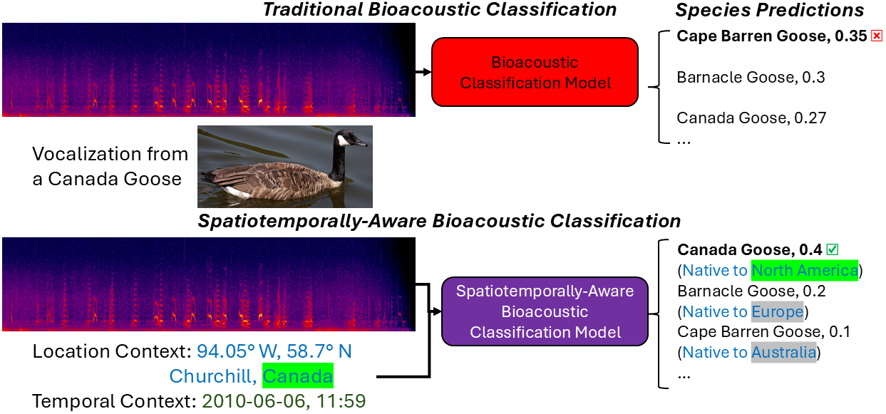
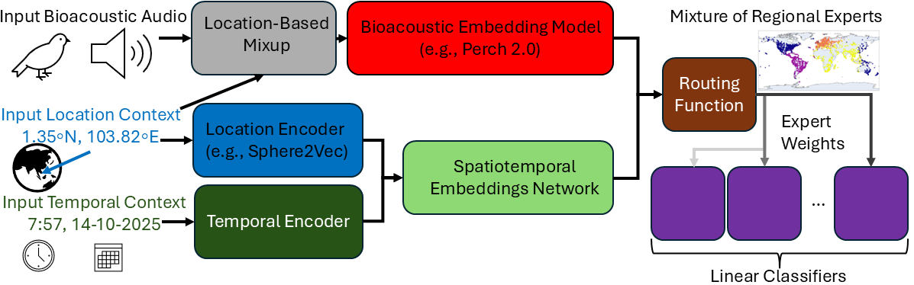

# SpatiotemporalBioacoustics
Repository for code from my PhD research project on spatiotemporally aware bioacoustic classification models.
*Introduction*
Traditional bioacoustic classification models aim to predict which animal species is/are vocalizing in a given audio sample, based on learned features from the audio. These models are usually trained on data from around the world and then apply transfer learning to train a classifier suited to a specific PAM dataset, which often focuses on a specific, narrow spatiotemporal range (e.g., a collection of recordings from within a national park over the course of one summer). To reduce the need for transfer learning, which requires costly manual annotation, we propose a method called **S**patiotemporal **M**ixture **o**f **R**egional **E**xperts (**SMoRE**) which incorporates the spatiotemporal context of where and when audio was recorded during training to automatically align class predictions with the species likely to be present in the spatiotempooral context where the data was recorded.

**SMoRE** combines a frozen bioacoustic audio embedding model (e.g., Perch 2.0) with a trainable spatiotemporal embeddings model, and passes concatenated audio and spatiotemporal embeddings for a given audio sample and it's corresponding location and date/time of recording to a Mixture-of-Experts classifier head. This classifier head computes routing weights based on these audio and spatiotemporal features, and outputs a weighted average of the output of several linear classifiers according to these weights. Experimentally, we find that the routing function learns regional specializations for each linear classifier.  

